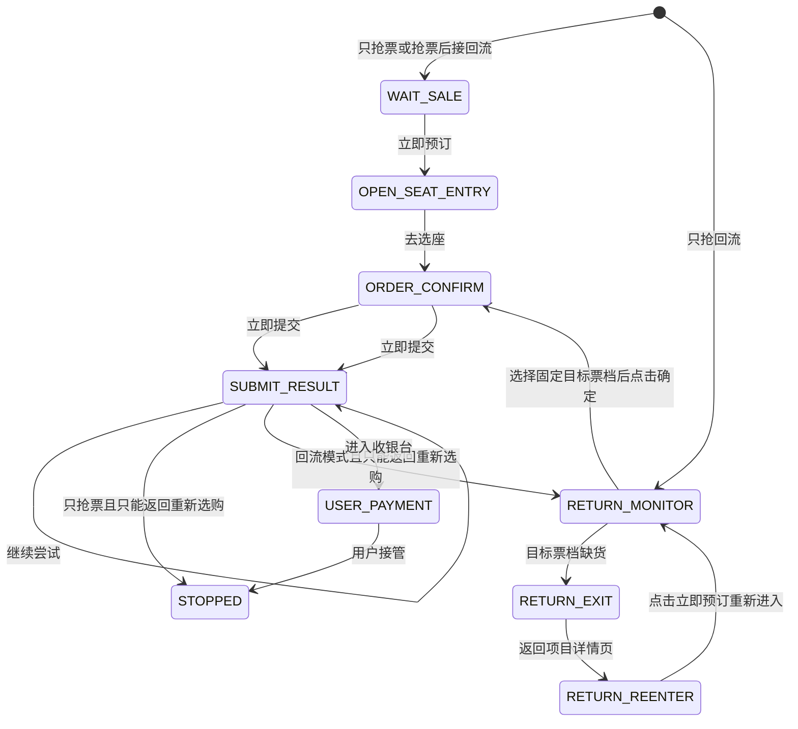

# 大麦 Android 平台业务逻辑

## 1. 文档范围

本文定义 `DamaiAndroidAdapter` 的页面判定、按钮优先级和状态转换。通用 Android 实现、悬浮控件、持久化和安全机制见[Android 技术方案](技术方案.md)。

本文流程只适用于 Android 大麦客户端。iOS 的回流规则见[大麦 iOS 业务逻辑](../../ios-app/docs/大麦业务逻辑.md)。

大麦流程支持三种模式：

| 模式 | 起点 | 首次抢票失败后的行为 |
| --- | --- | --- |
| 只抢票 | 项目详情页 | 停止 |
| 只抢回流 | 用户手动打开项目详情页或场次和票档页面 | 持续执行 Android 回流监控 |
| 抢票后接回流 | 项目详情页 | 点击“返回重新选购”后切换到回流监控 |

## 2. 用户准备

执行“只抢票”或“抢票后接回流”前，用户先在大麦自身的“抢票攻略/去设置”中完成：

- 目标日期和场次。
- 目标票档和对应价格。
- 购票数量。
- 实名观演人。

适配器不在开售瞬间重新选择这些信息。用户在本应用中填写相同的项目关键词、场次、票档、价格和数量，用于页面校验。

执行“只抢回流”时，用户手动打开目标项目的场次和票档页面，再从悬浮控件点击“开始”。

包含回流阶段的任务必须在开始前保存固定的 `targetSession`、`targetTier` 和 `targetPrice`。其中 `targetTier` 由“票档名称 + 价格”共同标识。运行期间页面当前选中的票档会变化，但固定目标不得跟随变化。

## 3. 串行主流程



任意阶段遇到未知页面、未知弹窗、验证页面或订单信息不一致时，进入安全暂停，不继续点击。

## 4. 首次开售流程

### 4.1 等待开售

起始页面为目标项目详情页。页面必须同时满足：

- 前台应用包名属于大麦适配器。
- 页面包含配置的项目关键词。
- 页面包含“抢票攻略”区域。
- 底部主按钮为“已预约”或“立即预订”。

当主按钮为“已预约”时保持监听，不点击。按钮变为可见、启用、可点击的“立即预订”后，执行一次点击并等待页面变化。

适配器不依赖倒计时文本触发动作，按钮的节点文本和可点击状态才是触发条件。

### 4.2 进入购票

下一页必须包含用户已经配置的场次、票档信息和“去选座”按钮。适配器校验信息一致后直接点击“去选座”，不重新选择日期或票档。

若页面提供的入口名称或结构与该指纹不一致，则暂停，不点击其他购买入口。

### 4.3 确认订单

确认页必须同时包含：

- “确认购买”。
- 配置的项目关键词、场次、票档、价格和数量。
- “实名观演人”。
- 已选择的观演人数与票数一致。
- 可点击的“立即提交”。

全部校验通过后点击一次“立即提交”。提交后立即进入弹窗判定状态，不继续操作确认页中的其他控件。

## 5. 提交结果弹窗

“立即提交”产生的结果以顶层弹窗覆盖在确认页上。只要弹窗存在，适配器就禁止点击下层的“立即提交”。

### 5.1 动作提取

适配器从顶层弹窗提取以下动作：

- `CONTINUE_TRY`：按钮文本为“继续尝试”。
- `RETURN_RESELECT`：按钮文本为“返回重新选购”。

页面说明文字只用于日志，动作选择只以可见、启用、可点击的按钮为准。

### 5.2 固定优先级

按钮优先级必须按以下顺序执行：

1. 弹窗存在“继续尝试”时，始终点击“继续尝试”。
2. 只有弹窗不存在“继续尝试”且存在“返回重新选购”时，才处理返回分支。
3. 两个按钮同时存在时仍选择“继续尝试”。
4. 没有以上已知按钮时安全暂停。

每次点击“继续尝试”都计入 `submitAttemptCount`。点击间隔受通用引擎节流控制；达到 `max_submit_attempts` 或最大运行时长后停止，不能形成无上限紧密循环。

### 5.3 返回分支

当弹窗只能“返回重新选购”时：

| 当前模式和阶段 | 动作 |
| --- | --- |
| 只抢票 | 记录本次无库存或页面失效，停止任务 |
| 抢票后接回流，当前为首次开售阶段 | 点击“返回重新选购”，切换到回流阶段 |
| 只抢回流 | 点击“返回重新选购”，继续回流阶段 |
| 抢票后接回流，当前已经是回流阶段 | 点击“返回重新选购”，继续回流阶段 |

点击返回后必须等待场次和票档页面重新出现，不能假定已经成功返回。

## 6. 回流监控流程

### 6.1 回流起始页

场次和票档页面必须同时包含：

- “场次”和“票档”。
- 配置的目标场次。
- 配置的目标票档。
- 底部主操作区域。

适配器先校验项目、场次和目标票档，再读取目标票档状态。

进入回流阶段时必须先从任务配置加载固定目标：

```text
targetTier    = 任务开始前保存的原始目标票档
selectedTier  = 当前页面选中的票档；重新进入时初始为空
```

两个值必须独立。改变 `selectedTier` 时，`targetTier` 始终保持不变。抢票后接回流模式沿用首次抢票任务中的原始目标；只抢回流模式使用用户在本应用配置的目标。

### 6.2 目标票档缺货

Android 场次和票档页面不会通过切换其他票档更新目标票档。目标票档显示“缺货登记”或节点不可点击时，执行退出重进循环：

1. 使用任务快照中的 `targetTier` 查找原始目标票档。
2. 确认目标票档仍缺货。
3. 不选择任何其他票档，不点击灰色的底部“确定”。
4. 通过可访问的返回节点退出；找不到返回节点时使用 Android 无障碍全局返回动作。
5. 等待目标项目详情页重新出现，并校验项目关键词。
6. 查找可见、启用、可点击的“立即预订”并点击。
7. 等待场次和票档页面重新出现。
8. 校验 `targetSession` 已经自动选中，不重新选择日期。
9. 再次使用固定的 `targetTier` 查找原始目标票档。
10. 目标票档仍缺货时，按受控间隔重复以上过程。

每轮循环必须完整确认“票档页 → 项目详情页 → 票档页”的页面变化。没有返回成功、没有识别到原项目详情页或没有重新进入成功时暂停，不能连续盲点返回或点击。

### 6.3 目标票档恢复

Android 重新进入场次和票档页面后，目标日期已经处于选中状态，但票档未自动选中，此时底部“确定”为灰色不可点击。适配器必须主动选择固定目标票档：

1. 校验自动选中的日期和场次等于 `targetSession`。
2. 使用任务快照中的 `targetTier` 定位目标票档。
3. 确认目标票档可见、启用且可点击。
4. 点击目标票档。
5. 确认选中态属于固定目标票档。
6. 校验票档名称和价格均与任务中的固定目标一致。
7. 将 `selectedTier` 更新为目标票档。
8. 确认底部“确定”已由灰色不可用变为启用且可点击。
9. 将数量调整或确认到配置值。
10. 再次校验目标日期、票档、价格和数量。
11. 点击“确定”。
12. 等待确认购买页，并重新执行订单信息校验。

未点击目标票档、目标票档仍缺货或“确定”仍为灰色时，禁止点击“确定”。适配器不得通过选择其他可售票档来激活按钮。

进入确认页后执行“立即提交”，结果继续交给第 5 节的弹窗规则处理。回流阶段不会因为一次返回重新选购而退出，只有成功进入收银台、用户停止或触发安全上限才结束。

## 7. 页面节点判定

适配器用多个节点共同确认页面，不用单一文本决定点击。

| 页面类型 | 必要节点依据 | 允许动作 |
| --- | --- | --- |
| 项目详情等待页 | 项目关键词、抢票攻略、已预约 | 等待 |
| 项目详情开售页 | 项目关键词、抢票攻略、可点击的立即预订 | 点击立即预订 |
| 购票入口页 | 已配置场次和票档、可点击的去选座 | 点击去选座 |
| 确认购买页 | 确认购买、订单信息、实名观演人、立即提交 | 校验后点击立即提交 |
| 提交结果弹窗 | 顶层弹窗、继续尝试和/或返回重新选购 | 按固定优先级点击 |
| Android 回流缺货页 | 自动选中的目标场次、目标票档、缺货登记、灰色确定 | 返回项目详情页 |
| Android 回流重进页 | 原项目关键词、可点击的立即预订 | 点击立即预订 |
| Android 回流待选票档页 | 自动选中的目标场次、未选中的目标票档、灰色确定 | 点击固定目标票档 |
| Android 回流可提交页 | 目标票档已选、价格和数量、可点击的确定 | 校验后点击确定 |
| 收银台 | 订单金额、支付方式、付款 | 停止并交给用户 |

同名文本出现在多个位置时，适配器还必须校验控件角色、可点击状态、父节点结构和窗口层级。

## 8. 收银台与成功边界

页面出现订单金额、支付方式和“付款”后，说明订单已经进入支付阶段。适配器执行：

1. 将运行状态设为 `ORDER_LOCKED`。
2. 清除所有待执行动作和计时器。
3. 通过悬浮日志、振动和系统通知提示用户。
4. 停止自动操作，由用户选择支付方式并手动付款。

进入收银台不等于支付成功。应用不点击“付款”，也不记录银行卡或支付信息。

## 9. 大麦动作与事件编码

| 编码 | 含义 |
| --- | --- |
| `DM_WAIT_RESERVED` | 主按钮仍为已预约 |
| `DM_CLICK_BOOK_NOW` | 点击立即预订 |
| `DM_CLICK_SEAT_ENTRY` | 点击去选座 |
| `DM_CLICK_SUBMIT` | 点击立即提交 |
| `DM_POPUP_CONTINUE` | 弹窗点击继续尝试 |
| `DM_POPUP_RETURN` | 弹窗点击返回重新选购 |
| `DM_SWITCH_TO_RETURN` | 首次开售切换到回流阶段 |
| `DM_RETURN_BACK_TO_DETAIL` | Android 回流退出到项目详情页 |
| `DM_RETURN_REENTER` | 点击立即预订重新进入票档页 |
| `DM_SELECT_TARGET_TIER` | 主动选择固定目标票档 |
| `DM_TARGET_TIER_AVAILABLE` | 目标票档恢复可购 |
| `DM_CONFIRM_TARGET_TIER` | 校验后点击确定 |
| `DM_ORDER_LOCKED` | 到达收银台并交给用户 |
| `DM_SAFE_PAUSE` | 页面未知或信息不一致 |

日志只记录上述编码、阶段、次数和脱敏原因。

## 10. 验收用例

### 10.1 首次开售

- “已预约”期间不产生点击。
- 按钮变为可点击的“立即预订”后只点击一次。
- 购票入口页直接点击“去选座”，不重新选择日期和票档。
- 订单信息全部一致时才点击“立即提交”。

### 10.2 弹窗

- 只有“继续尝试”时点击“继续尝试”。
- “继续尝试”和“返回重新选购”同时存在时点击“继续尝试”。
- 只有“返回重新选购”时按运行模式分支。
- 弹窗存在时绝不点击下层“立即提交”。
- 弹窗按钮未知时进入安全暂停。

### 10.3 回流

- 抢票后接回流模式只在首次开售弹窗只能返回时切换阶段。
- 从首次开售切换到回流后，固定目标票档仍是任务开始前配置的原始票档。
- 目标票档缺货时返回项目详情页，再点击“立即预订”重新进入。
- 退出和重新进入期间，固定目标票档和目标价格不发生变化。
- 重新进入后目标日期已经选中，不重复点击日期。
- 重新进入后票档没有选中，“确定”保持灰色。
- 只点击固定目标票档，不点击其他价位。
- 固定目标票档选中并且“确定”变为可点击后才允许提交。
- 暂停恢复或页面重新加载后，继续从任务快照读取固定目标票档。
- 目标票档恢复后重新校验票档、价格和数量，再点击“确定”。
- 回流提交失败并返回后继续回流监控。

### 10.4 安全停止

- 项目、场次、票档、价格、数量或观演人数不一致时暂停。
- 出现登录、验证码、风控或未知页面时暂停。
- 达到最大提交次数或运行时长时停止。
- 进入带有支付方式和“付款”的收银台后停止所有自动操作。
