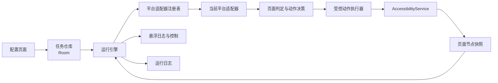
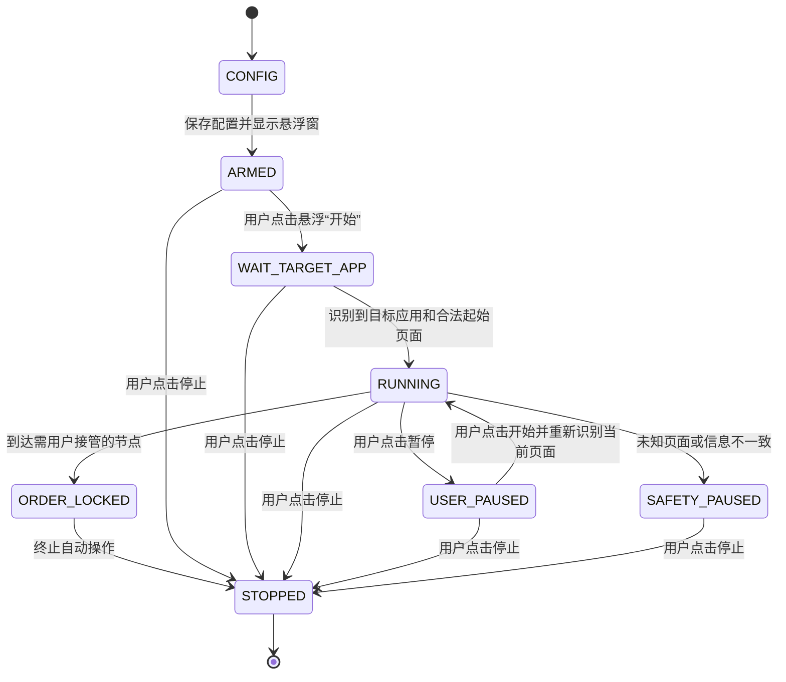

# Android 购票辅助系统技术方案

## 1. 文档范围

本文定义 `android-app` 工程的通用实现，不包含任何特定售票平台的页面流程。平台页面、按钮名称和分支规则由 Android 平台适配器负责。

首个发布形态为可直接安装的 APK。应用使用 Kotlin、Jetpack Compose、AccessibilityService 和 Room 实现，付款始终由用户手动完成。

Android 与 iOS 是两个独立工程。本文不定义 `ios-app` 的技术实现；iOS 方案见[iOS 技术方案](../../ios-app/docs/技术方案.md)。

## 2. 产品边界

系统负责：

- 保存平台、运行模式和购票目标等任务配置。
- 在用户手动打开售票应用后识别当前页面状态。
- 按平台适配器定义执行有限、可追踪的点击。
- 在页面未知、信息不一致、出现验证或进入收银台时立即停止。
- 通过左上角悬浮控件展示实时日志，并允许用户暂停或停止。

系统不负责：

- 自动启动或接管售票应用。
- 保存账号密码、登录凭证、Cookie、Token、身份证号或银行卡信息。
- 绕过验证码、风控、排队、设备校验或平台限制。
- 自动完成付款。
- 在未知页面上使用固定坐标盲点。

## 3. 运行模式

通用引擎定义三种运行模式：

| 枚举 | 界面名称 | 行为 |
| --- | --- | --- |
| `SALE_ONLY` | 只抢票 | 完成首次开售流程；失败后停止 |
| `RETURN_ONLY` | 只抢回流 | 从平台指定的回流起始页面开始监控 |
| `SALE_THEN_RETURN` | 抢票后接回流 | 首次开售失败后自动切换到回流阶段 |

平台适配器必须声明自己支持哪些模式。配置页面只展示当前版本已经实现的选项。

## 4. 总体架构



### 4.1 模块职责

| 模块 | 职责 |
| --- | --- |
| `app-ui` | 配置页面、权限引导、任务启动 |
| `task-store` | Room 数据库、配置校验、运行记录 |
| `accessibility-core` | 监听窗口事件、读取节点、执行节点动作 |
| `automation-engine` | 状态机、节流、重试上限、暂停和停止 |
| `platform-api` | 平台适配器接口、统一页面和动作模型 |
| `platform-*` | 各售票平台在 Android 上的页面指纹和业务分支 |
| `overlay` | 顶层日志窗口与开始、暂停、停止控制 |

### 4.2 平台适配器

`PlatformAdapterRegistry` 根据前台应用包名选择 Android 适配器。每个适配器实现以下能力：

```kotlin
interface PlatformAdapter {
    val platform: TicketPlatform
    val supportedPackages: Set<String>
    val supportedModes: Set<RunMode>

    fun detectPage(snapshot: UiSnapshot, task: TicketTask): PageResult
    fun decideAction(
        page: PageResult,
        task: TicketTask,
        runtime: RuntimeState
    ): ActionDecision
}
```

通用引擎只处理标准结果：

- `Recognized(pageType, evidence)`：页面已识别，并保存用于审计的节点依据。
- `Unknown(reason)`：证据不足，暂停任务。
- `Mismatch(field, expected, actual)`：项目、场次、票档或数量不一致，暂停任务。
- `ActionDecision.Click(target)`：点击已定位且可点击的节点。
- `ActionDecision.Wait(reason)`：保持监听，不产生操作。
- `ActionDecision.SwitchPhase(phase)`：切换首次开售或回流阶段。
- `ActionDecision.Stop(reason)`：停止任务。

平台适配器不得直接循环点击，也不得自行绕过通用引擎的节流、安全校验和日志记录。

### 4.3 Android 适配器注册

`android-app` 中的适配器唯一键为售票平台：

```text
AdapterKey(ticketPlatform)
```

首个实现为 `DamaiAndroidAdapter`。iOS 适配器不进入该注册表，也不编译进 APK。

## 5. 页面识别与动作执行

### 5.1 无障碍服务配置

核心识别入口为 `AccessibilityService`。服务配置至少包含：

- `android:canRetrieveWindowContent="true"`。
- 只订阅已实现平台的包名。
- 监听 `TYPE_WINDOW_CONTENT_CHANGED`、`TYPE_WINDOW_STATE_CHANGED`、`TYPE_WINDOWS_CHANGED` 和 `TYPE_VIEW_TEXT_CHANGED`。
- 需要识别独立弹窗窗口时启用 `FLAG_RETRIEVE_INTERACTIVE_WINDOWS`。

服务收到事件后不直接点击，而是通知运行引擎重新构建一次稳定的页面节点快照。

### 5.2 节点定位顺序

节点定位使用以下优先级：

1. 稳定的 `viewIdResourceName`。
2. 稳定的 `contentDescription`。
3. 可见文本、控件角色、`isEnabled`、`isClickable` 的组合。
4. 已识别父节点内的相对结构。

动作执行前必须再次确认：

- 目标节点仍存在。
- 节点处于可见、启用和可点击状态。
- 当前窗口仍属于目标售票应用。
- 当前页面指纹与动作要求一致。
- 节点边界没有落入本应用的悬浮控件区域。

若节点本身不可点击，只允许向上查找最近的可点击父节点；找不到时暂停，不使用屏幕坐标代替。

### 5.3 页面稳定与去重

窗口事件会在一次页面更新中连续触发。引擎按以下规则去重：

- 收到事件后等待短暂稳定窗口，再读取完整节点树。
- 对关键文本、窗口类型和目标节点生成页面指纹。
- 相同指纹、相同动作在冷却时间内只执行一次。
- 点击后等待页面指纹变化；未变化时按受控重试规则处理。
- 所有动作都绑定 `runId` 和单调递增的 `actionId`，旧任务产生的延迟动作不得执行。

具体稳定窗口、冷却时间和重试上限由平台适配器提供默认值，由通用安全上限约束。

### 5.4 顶层弹窗优先

页面快照按窗口层级排序。存在顶层弹窗时：

1. 只允许平台适配器解析顶层弹窗。
2. 禁止点击被遮挡页面中的按钮。
3. 弹窗没有已知安全动作时暂停并提示用户。

本应用创建的无障碍悬浮窗口必须在快照预处理阶段排除，不能被识别为售票平台页面。

## 6. 运行状态机



`RUNNING` 内部还保存平台阶段，例如首次开售、回流监控、订单提交。阶段切换只能由适配器返回明确的 `SwitchPhase` 决策。

暂停和恢复规则：

- 点击暂停后立即取消等待中的动作和计时器。
- 恢复时重新读取并识别当前页面。
- 恢复后不重放暂停前尚未完成的点击。
- 点击停止后清除整个 `runId` 的动作队列、计时器和前台服务状态。

## 7. 配置页面

### 7.1 首次打开

应用首次打开直接显示配置页面。必填信息包括：

- 售票平台。
- 运行模式。
- 演出日期（系统日期选择器，保存为 `YYYY-MM-DD`）。
- 票档价格（元）。

平台特有字段由适配器提供定义。未选择必填项时，“开始”不可用。

演出日期和票档价格在任务开始时生成不可变目标快照。日期只比较年月日，
不比较星期、开场时间或销售状态文字；价格用于定位唯一票档。

### 7.2 保存配置与手动开始

用户点击“保存配置并显示悬浮窗”后依次执行：

1. 校验配置和无障碍权限。
2. 保存任务并生成新的 `runId`。
3. 启动前台服务和悬浮控件。
4. 将配置页面移到后台。
5. 进入 `ARMED`，不识别页面，也不执行点击。

用户自行打开目标大麦页面，再点击悬浮“开始”。此时任务进入
`WAIT_TARGET_APP`，请求一份点击之后产生的新页面快照；识别到合法起始页后才进入
`RUNNING`。

应用不主动打开售票软件，也不改变用户正常切换应用的方式。

## 8. 左上角悬浮控件

悬浮控件使用 `TYPE_ACCESSIBILITY_OVERLAY`，固定在左上角安全区域，避开状态栏和屏幕开孔。它不提供平台、票档或模式修改功能。

为确保不影响售票页面操作，悬浮控件拆成两个窗口：

### 8.1 日志窗口

- 完全透明或低透明背景。
- 只展示最近 3 至 4 行短日志。
- 设置 `FLAG_NOT_FOCUSABLE | FLAG_NOT_TOUCHABLE`。
- 不获取输入焦点，不接收触摸，不拦截下层页面。

### 8.2 控制窗口

- 只覆盖两个按钮自身的最小范围。
- 设置 `FLAG_NOT_FOCUSABLE | FLAG_NOT_TOUCH_MODAL`。
- 按钮外的触摸继续传递给售票应用。
- 运行中显示“暂停”和“停止”。
- 暂停后原“暂停”按钮变为“开始”；“停止”保持不变。

控件不支持展开、拖动或复杂样式，且不得覆盖页面底部的购买和提交区域。

### 8.3 实时日志

每条日志包含：

- 时间。
- 当前阶段。
- 已识别页面或弹窗。
- 执行的动作和次数。
- 等待、暂停或停止原因。

日志不得包含姓名、证件号、手机号、订单号、支付信息和完整项目页面内容。

## 9. 数据设计

### 9.1 `ticket_task`

| 字段 | 类型 | 说明 |
| --- | --- | --- |
| `id` | Long | 主键 |
| `platform` | String | 平台枚举 |
| `run_mode` | String | 运行模式 |
| `event_keyword` | String | 兼容旧数据库的保留列，新任务写空字符串 |
| `target_session` | String? | 固定演出日期，格式为 `YYYY-MM-DD` |
| `target_tier` | String? | 兼容旧数据库的保留列，新任务写空字符串 |
| `target_price_fen` | Long? | 固定目标单价，单位分 |
| `ticket_count` | Int? | 兼容旧数据库的保留列 |
| `adapter_config` | String | 平台特有配置 JSON |
| `max_submit_attempts` | Int | 兼容旧数据库的保留列；新任务写入 0，运行时不读取 |
| `max_runtime_seconds` | Long | 兼容旧数据库的保留列；新任务写入 0，运行时不读取 |
| `state` | String | 任务状态 |
| `created_at` | Instant | 创建时间 |
| `updated_at` | Instant | 更新时间 |

`adapter_config` 只保存非敏感业务设置，不保存平台登录态或实名信息。

### 9.2 回流运行态

回流运行态必须分开保存以下信息：

| 字段 | 说明 |
| --- | --- |
| `targetPrice` | 从任务配置读取的固定票档价格，运行期间只读 |
| `selectedPrice` | 当前页面实际选中的票档价格；Android 重进后可为空 |
| `returnCycleState` | Android 回流循环阶段：检查票档、退出详情、重新进入 |
| `returnCycleCount` | 已完成的退出重进次数 |

`selectedPrice` 只能记录页面临时状态，禁止写回或替换 `targetPrice`。首次开售切换到
回流阶段、暂停后恢复或页面重新进入时，都必须重新从任务快照取得 `targetPrice`。

### 9.3 `run_log`

| 字段 | 类型 | 说明 |
| --- | --- | --- |
| `id` | Long | 主键 |
| `run_id` | String | 单次运行标识 |
| `phase` | String | 当前阶段 |
| `event_code` | String | 标准事件编码 |
| `sanitized_detail` | String | 脱敏说明 |
| `created_at` | Instant | 发生时间 |

运行日志设置保留期限，并允许用户从配置页一键清除。

## 10. 安全约束

出现以下任一情况时，系统不得继续自动点击：

- 前台包名不是目标平台。
- 项目、场次、票档、价格或数量与配置不一致。
- 页面或弹窗无法由适配器唯一识别。
- 出现登录、验证码、风控、设备校验或权限页面。
- 达到同页动作重试或连续异常上限。
- 到达收银台、支付选择或付款页面。
- 用户点击暂停或停止。

到达需用户处理的节点时，系统写入原因、停止动作队列并通过振动或通知提醒用户。

## 11. 测试与验收

### 11.1 平台适配器契约测试

每个适配器都必须覆盖：

- 只凭声明的节点证据识别页面。
- 信息不匹配时返回 `Mismatch`。
- 顶层弹窗存在时不返回下层页面动作。
- 未知页面返回 `Unknown`。
- 不产生无上限重试或坐标点击。

### 11.2 Android 集成测试

- 用户点击开始后，售票应用不会被自动打开。
- 用户能正常打开、切换和操作售票应用。
- 日志区域不接收触摸，控制区域外的触摸不被拦截。
- 暂停立即取消待执行动作，恢复后重新识别页面。
- 停止后不再产生任何点击。
- 本应用悬浮窗口不会被识别为平台页面。
- 旋转、分屏、字体缩放和不同屏幕尺寸下，悬浮控件仍位于安全区域。
- 收银台、验证页和未知弹窗均能触发安全停止。

UI Automator 只用于自动化测试 APK 的页面切换和断言，不参与正式运行时逻辑。

### 11.3 发布

- 使用固定应用 ID 和正式签名生成 release APK。
- 密钥不提交到仓库。
- 每个版本记录数据库迁移、适配器版本和已验证的平台应用版本。
- 平台界面更新后，先更新适配器测试样本并完成回归，再发布 APK。

## 12. 实施顺序

1. 建立 Android 工程、Compose 配置页和 Room 数据库。
2. 完成无障碍权限引导、前台服务和节点快照模型。
3. 完成运行状态机、动作去重、节流和安全停止。
4. 完成左上角日志窗口与控制窗口。
5. 定义 `PlatformAdapter` 接口和注册表。
6. 接入第一个平台适配器并完成契约测试。
7. 完成真机集成测试、release 签名和 APK 交付。

## 13. Android 参考资料

- [AccessibilityService API](https://developer.android.com/reference/android/accessibilityservice/AccessibilityService)
- [创建无障碍服务](https://developer.android.com/guide/topics/ui/accessibility/service)
- [WindowManager.LayoutParams](https://developer.android.com/reference/android/view/WindowManager.LayoutParams)
- [使用 Room 保存本地数据](https://developer.android.com/training/data-storage/room)
- [UI Automator 测试](https://developer.android.com/training/testing/other-components/ui-automator)
