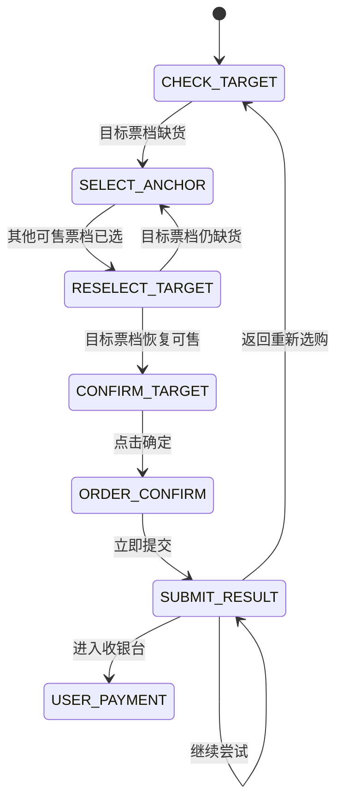

# 大麦 iOS 业务逻辑

## 1. 文档范围

本文保留大麦 iOS 客户端的页面状态和回流票规则，供未来 `ios-app` 和 XCUITest 流程测试使用。

Android 采用退出重进方式刷新票档，见[大麦 Android 业务逻辑](../../android-app/docs/大麦业务逻辑.md)。iOS 不使用 Android 的退出重进循环。

## 2. 固定目标

任务开始前必须保存：

- `targetSession`：目标日期和场次。
- `targetTier`：目标票档名称。
- `targetPrice`：目标价格。
- `ticketCount`：数量。

回流时点击其他票档只用于触发页面更新。无论页面当前选中哪个票档，原始 `targetTier` 和 `targetPrice` 都不能改变。

## 3. 首次开售流程

执行首次抢票前，用户先在大麦自己的抢票设置中选好目标日期、票档、数量和实名观演人。

1. 在项目详情页等待底部主按钮由“已预约”变为可点击的“立即预订”。
2. 点击“立即预订”。
3. 进入购票页面后校验预先配置的日期和票档，不临时改成其他目标。
4. 点击“去选座”进入确认购买页。
5. 校验项目、场次、票档、价格、数量和实名观演人数。
6. 点击“立即提交”。
7. 提交结果交给第 6 节的弹窗优先级处理。

任何目标信息不一致时停止流程。

## 4. iOS 与 Android 回流差异

| 环节 | Android | iOS |
| --- | --- | --- |
| 目标票档缺货后的动作 | 退出场次/票档页 | 留在场次/票档页 |
| 页面更新方式 | 回到项目详情，再点“立即预订”重新进入 | 点击一个可售的其他票档，再切回固定目标票档 |
| 重新进入后的日期 | 自动选中，只校验 | 不退出页面，目标场次保持不变 |
| 票档选择 | 重新进入后必须主动选择目标票档 | 每轮从刷新票档切回目标票档 |
| 其他票档作用 | 不点击 | 只作为 `refreshAnchorTier` |
| 可以确认的条件 | 目标票档已选且“确定”可点击 | 目标票档已选且“确定”可点击 |

## 5. iOS 回流流程

### 5.1 检查目标票档

场次和票档页面必须包含配置的 `targetSession` 和 `targetTier`。先校验场次，再读取固定目标票档状态。

目标票档已经可售时，直接进入第 5.3 节。

### 5.2 切换票档刷新

目标票档显示“缺货登记”时：

1. 在同一目标场次中查找一个当前可售、可点击的非目标票档。
2. 将其记录为 `refreshAnchorTier`。
3. 点击 `refreshAnchorTier`。
4. 等待选中状态和页面节点发生变化。
5. 再点击或重新选中固定的 `targetTier`。
6. 重新读取固定目标票档的缺货、启用和可点击状态。
7. 仍然缺货时，选择可售刷新票档并重复。

`refreshAnchorTier` 只用于刷新，绝不能覆盖固定目标，也不能在它处于选中状态时点击“确定”。

没有其他可售票档时保持等待，不点击“确定”，也不切换场次。

### 5.3 目标票档恢复

固定目标票档变为可售后：

1. 点击固定 `targetTier`。
2. 确认选中态属于固定目标票档。
3. 校验票档名称和价格等于 `targetTier`、`targetPrice`。
4. 校验或调整数量为 `ticketCount`。
5. 确认底部“确定”已经启用且可点击。
6. 再次校验当前选中的不是 `refreshAnchorTier`。
7. 点击“确定”进入确认购买页。

任何一项不一致都停止确认并提示用户。

## 6. 首次抢票与回流串行

支持：

- 只抢票。
- 只抢回流。
- 抢票后接回流。

首次抢票提交后的顶层弹窗按以下固定优先级处理：

1. 有“继续尝试”时优先选择“继续尝试”。
2. 没有“继续尝试”、只有“返回重新选购”时：
   - 只抢票模式停止。
   - 抢票后接回流模式返回票档页并进入 iOS 回流循环。
   - 只抢回流模式继续 iOS 回流循环。
3. 弹窗未知时停止自动流程。

弹窗存在时禁止操作下层确认页。

## 7. 收银台

出现订单金额、支付方式和“付款”后：

1. 停止回流和提交状态机。
2. 清除待执行动作。
3. 提醒用户接管。
4. 由用户手动完成付款。

进入收银台不等于支付成功。

## 8. iOS 回流事件

| 编码 | 含义 |
| --- | --- |
| `DM_IOS_TARGET_SOLD_OUT` | 固定目标票档缺货 |
| `DM_IOS_SELECT_REFRESH_TIER` | 选择其他可售票档刷新 |
| `DM_IOS_RESELECT_TARGET_TIER` | 切回固定目标票档 |
| `DM_IOS_TARGET_AVAILABLE` | 固定目标票档恢复 |
| `DM_IOS_CONFIRM_TARGET` | 校验后点击确定 |
| `DM_IOS_POPUP_CONTINUE` | 点击继续尝试 |
| `DM_IOS_POPUP_RETURN` | 点击返回重新选购 |
| `DM_IOS_ORDER_LOCKED` | 进入收银台并交给用户 |

## 9. 验收用例

- 目标票档缺货时不退出场次和票档页面。
- 只选择同一目标场次内的其他可售票档进行刷新。
- 刷新票档不会覆盖固定目标票档和价格。
- 每轮刷新后都会切回并检查固定目标票档。
- 刷新票档仍处于选中状态时绝不点击“确定”。
- 目标票档恢复、被选中且信息一致后才点击“确定”。
- “继续尝试”和“返回重新选购”同时存在时优先“继续尝试”。
- 进入收银台后停止，由用户手动付款。
