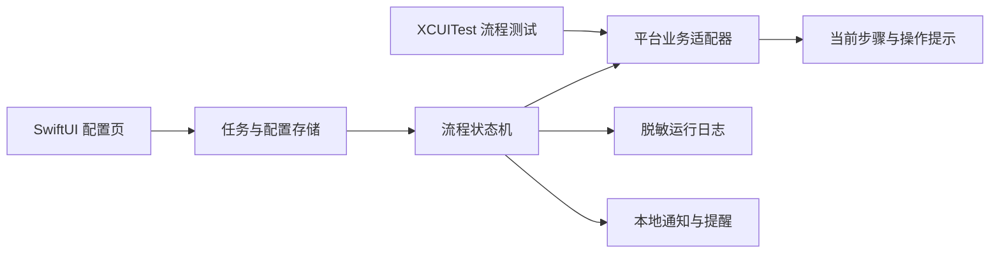
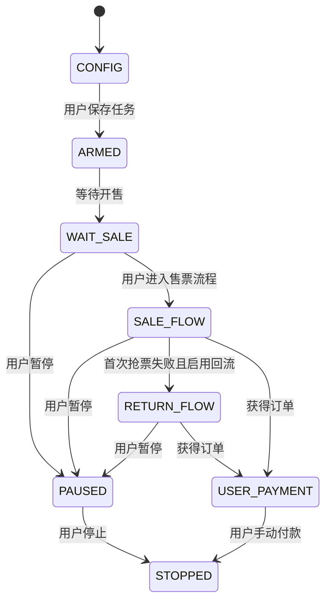

# iOS 购票辅助系统技术方案

## 1. 文档范围

本文定义未来 `ios-app` 独立工程的技术边界和模块设计。工程使用 Swift、SwiftUI 和本地持久化，不与 `android-app` 共享运行时代码。

大麦 iOS 的具体页面与回流流程见[大麦 iOS 业务逻辑](大麦业务逻辑.md)。

## 2. 工程边界

目录结构：

```text
DaMai/
├── android-app/    # Kotlin、Compose、AccessibilityService、Room
├── ios-app/        # Swift、SwiftUI
└── docs/
```

两个工程分别构建和发布：

| 项目 | Android | iOS |
| --- | --- | --- |
| 工程目录 | `android-app` | `ios-app` |
| 语言 | Kotlin | Swift |
| 界面 | Jetpack Compose | SwiftUI |
| 本地数据 | Room | SwiftData |
| 安装包 | APK | 签名的 iOS App |
| 页面控制能力 | `AccessibilityService` | 标准 iOS App 不具备 Android 同等的跨应用节点控制能力 |

## 3. iOS 平台能力限制

`UIAccessibility` 用于描述和改善本应用自己的界面可访问性，不提供 Android `AccessibilityService` 对其他前台应用的节点读取和点击能力。

`XCTest` 与 `XCUIAutomation` 用于 Xcode 工程的用户界面测试。它们可以作为大麦 iOS 流程的开发验证工具，但不能当作普通用户安装后持续运行的生产自动化引擎。

iOS 和 iPadOS 对第三方应用实行代码签名和严格沙箱隔离。因此，在没有售票平台公开接口、正式 SDK 或其他获得授权的系统能力时，`ios-app` 不实现以下功能：

- 读取大麦 App 的实时控件树。
- 在大麦 App 上方显示 Android 式可点击悬浮窗。
- 在后台持续点击大麦 App。
- 使用私有 API、越狱能力或未授权注入。

当前 iOS 方案保留配置、流程状态、目标票档、提醒和业务规则；跨应用自动执行部分必须等到存在合规且可发布的运行能力后再实现。

## 4. 模块设计



| 模块 | 职责 |
| --- | --- |
| `AppUI` | 平台、模式、项目、场次、票档和数量配置 |
| `TaskStore` | 本地任务、固定目标快照、运行记录 |
| `FlowEngine` | 首次开售、回流、暂停和停止状态机 |
| `PlatformAdapter` | 各售票平台的 iOS 页面词汇和流程规则 |
| `UserGuide` | 根据当前阶段向用户展示下一步操作 |
| `NotificationService` | 开售时间、本地提醒和任务状态通知 |
| `UITests` | 使用 XCUITest 验证业务流程，不进入生产 App |

## 5. 配置和数据

任务开始前保存不可变目标：

| 字段 | 说明 |
| --- | --- |
| `platform` | 售票平台 |
| `runMode` | 只抢票、只抢回流、抢票后接回流 |
| `eventKeyword` | 项目识别关键词 |
| `targetSession` | 固定目标日期和场次 |
| `targetTier` | 固定目标票档名称 |
| `targetPrice` | 固定目标价格 |
| `ticketCount` | 购票数量 |
| `maxAttempts` | 最大尝试次数 |

回流期间选中的其他票档只是 `refreshAnchorTier`，不得覆盖 `targetTier`。

## 6. 界面

### 6.1 配置页

首次打开进入配置页，包含平台、运行模式和目标信息。配置完成后进入任务状态页。

### 6.2 任务状态页

状态页显示：

- 当前阶段。
- 固定目标场次和票档。
- 最近操作提示。
- 开始、暂停和停止。
- 脱敏日志。

iOS 标准 App 不能在大麦 App 上方保留 Android 式交互悬浮窗。用户切换到大麦后，状态通过本地通知或用户返回本 App 查看。

## 7. 状态机



状态机保存业务阶段和提示，不把 XCUITest 测试动作包装成生产 App 功能。

## 8. 测试

- 固定目标票档不会被刷新票档覆盖。
- Android 与 iOS 回流策略分别加载，不交叉调用。
- 首次抢票失败后按运行模式切换或停止。
- iOS 回流严格执行“其他可售票档 → 固定目标票档”的顺序。
- 固定目标票档未选中时不得进入确认流程。
- 到达支付阶段后停止流程并由用户接管。
- XCUITest 仅位于测试 Target。

## 9. 后续实施条件

开始开发 `ios-app` 自动执行能力前，必须先确认存在可用于正式发布的跨应用控制方式。若没有该能力，则 iOS 工程只实现配置、提醒、流程提示和日志，不宣称能够自动点击其他 App。

## 10. Apple 参考资料

- [Accessibility for UIKit](https://developer.apple.com/documentation/uikit/accessibility-for-uikit)
- [UIAccessibility](https://developer.apple.com/documentation/uikit/uiaccessibility)
- [XCTest](https://developer.apple.com/documentation/xctest)
- [Adding tests to your Xcode project](https://developer.apple.com/documentation/xcode/adding-tests-to-your-xcode-project)
- [Apple 平台 App 安全概览](https://support.apple.com/guide/security/sec35dd877d0/web)
